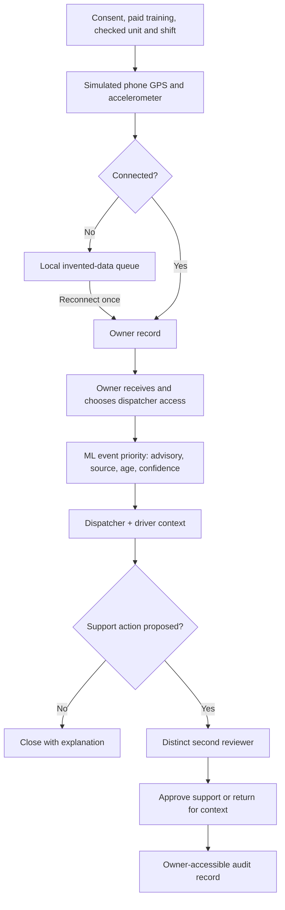
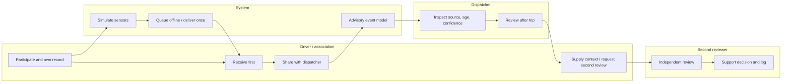

# COLECTIVO — Operator packet
Emiliano Carballido · Business Bending Week 7 · 27 September 2026

## Problem in my words
Installing a tracker is easier than keeping it powered, assigning a relief shift correctly, and reviewing an ambiguous brake flag with the person who generated it. This slice makes that daily work visible without turning measurement into punishment. No fieldwork, signed customer, hardware test, savings or safety impact is claimed.

## Exact user and buyer
Primary user: the route association's Spanish-speaking dispatcher at a Naucalpan base, supported by a backup dispatcher and technician. Measured partners: participating drivers and the route association, who receive their records first. Primary buyer: route association. Government access is outside this slice. The Blueprint distinguishes Edomex/SITRAMyTEM from CDMX/SEMOVI; its jurisdiction correction remains a team discussion item, not a verified legal opinion here.

## Success before the module closes
A visitor can onboard an invented unit, inspect simulated GPS/accelerometer/device-health data on an illustrative coordinate map, receive its record in the owner view, release it to dispatch, review advisory ML priority with driver context, and request a distinct second reviewer before a support action closes. Offline samples queue and synchronize once. A pilot view calculates 95% usable scheduled vehicle-hours and 90% same-operating-day priority review gates from explicitly synthetic denominators. Two consecutive failed weeks, unfunded support or unresolved misuse pause expansion. Ten vehicles, two baseline weeks plus six feedback weeks; any later expansion goes through 25 first.

## Image-generated mockup before code

Generated with the built-in image-generation tool before application code. Prompt: high-fidelity Spanish dispatcher console, warm ivory and forest green, simulated-data banner, 10-unit pilot, illustrative route map, advisory event queue with source/recency/confidence, owner-first workflow, no scores or penalties. Concept only; final UI may differ.

## Flowchart

## Swimlane

## Researched benchmark
The strongest existing fleet-event workflow benchmark selected for this slice is Samsara Safety Inbox: its first-party documentation describes an event queue with review and follow-up status. This is a design benchmark, not an independently established global ranking or impact claim.
Mine localizes through Spanish shared-vehicle operations, owner-first receipt, driver context and separate review without driver scoring or financial penalties. Digital Matatus provides the complementary participatory mapping benchmark: phone-based route collection with local collaboration, not proof of safety improvement.
Sources accessed 27 September 2026:
- https://www.samsara.com/blog/safety-inbox-faster-easier-management-of-safety-incidents — vendor workflow description, not independently verified impact.
- https://developers.samsara.com/reference/getsafetyeventsv2stream — documented review states.
- https://www.digitalmatatus.com/ — project methodology; no local field validation performed.

## Three-year light charter
In year one, a funded ten-vehicle pilot establishes maintainable data and a paid, accountable review process with driver access. In year two, only demonstrated operating gates permit expansion through 25 vehicles, with contributor compensation and independent misuse review. In year three, associations could govern a shared route-knowledge service, with separately consented nonexclusive planning exports and no resale or autonomy-training reuse without contributor agreement and compensation.

## Scope cut
No ride hailing, cabin cameras, panic button, emergency dispatch, real tracking, personal-data collection, payments, driver ranking, automated sanctions or government enforcement export. No production authentication is implied by a demo role switch. No hardware or model generalization claim. Production personal data requires Google sign-in via Supabase Auth, row-level isolation, access logs, tested retention/incident holds and a reviewed deployment before collection.

## Architecture / Dragon Stack
| Layer | Implementation | Limit |
|---|---|---|
| Maps / geodata | Local GeoJSON-style longitude/latitude fixture projected into interactive SVG route map | Invented approximate Naucalpan geography; no navigation |
| ML | Small nearest-neighbor event classifier fitted on labeled synthetic sensor examples; per-event priority and neighbor agreement | Real algorithm, synthetic training; agreement is not calibrated probability or validated safety risk |
| Phone telemetry / sensors | Deterministic GPS, acceleration, battery and age simulator; offline queue | No device permissions or real sensor capture |
| Workflow | Browser state machine, owner receipt before dispatch, driver context, distinct second-review role | Role simulation, not identity verification |
| Storage | Browser storage for invented fixed-choice demo records, reset/export | No real people, no free-text personal records or server database |
| Delivery | Static HTML/CSS/JavaScript; free hosting if account access permits | Hosting outcome documented only after verification |

## Blueprint controls
1. No driver charges, deductions or financial consequence features; paid training and downtime compensation are launch checks.
2. Owner receives records before dispatch; owner-only export; no downstream sharing feature or exclusive contract.
3. No scoring, penalties or dismissal. Support follow-up requires human review, context and distinct second reviewer. Reopen/appeal channel remains available.
4. Each advisory flag shows source, age, model agreement and uncertainty; driver retains route authority.
5. Enforcement/compliance sales are out of scope; do not apply CDMX mandates to Naucalpan.
6. Gates describe operations, never injuries prevented or money saved. All synthetic metrics labeled.

## Pilot infrastructure
Launch checklist: fictional budget holder, dispatcher, backup and technician; owner participation; regular and relief-driver training; checked device/vehicle/shift; offline drill; funded connectivity, repairs, paid training, downtime and renewal. Substitute unchecked units remain coverage gaps. Proposed production routine retention is 30 days, with documented incident holds; demo records can be erased immediately.

## Test plan
- Onboard: required fixed-choice assignments and consent/training checks block incomplete submission; duplicate unit rejected.
- Ownership: new telemetry appears to owner first; unshared records absent from dispatcher queue.
- ML: synthetic class fixtures give expected class; confidence and source visible; no driver aggregation.
- Offline: generate while offline, reload, reconnect; all queued IDs delivered once without duplicate records.
- Review: driver context required; support proposal cannot close without second reviewer; primary reviewer cannot self-approve; return/reopen works.
- Gates: exact threshold passes, zero denominators show no evidence, two failed weeks pause; funding/misuse overrides.
- Forms/security: fixed enumerations, bounds, persisted-data validation, safe rendering; no secrets or personal seeds; no server database means RLS not applicable to demo.
- Browser: full owner-to-review path, navigation, map selection, mobile layout, console errors.
- Mechanical test: record actual failure, fix, regression and redeploy; never inject a fake bug for evidence.
- Fresh synthetic persona: screenshots in a separate context, narrated task attempt, confusion log; fix highest-impact confusion. Not a real participant study.

## Evidence plan
Commit this packet before code. Then implementation prompt, core model/workflow, UI/deploy one, mechanical fix/deploy two, persona fix and delivery notes (at least five meaningful commits). Save actual commands/results, deployment IDs/URLs and screenshot evidence. Build-chat PDF will be explicitly an evidence log if a full transcript cannot be exported.
